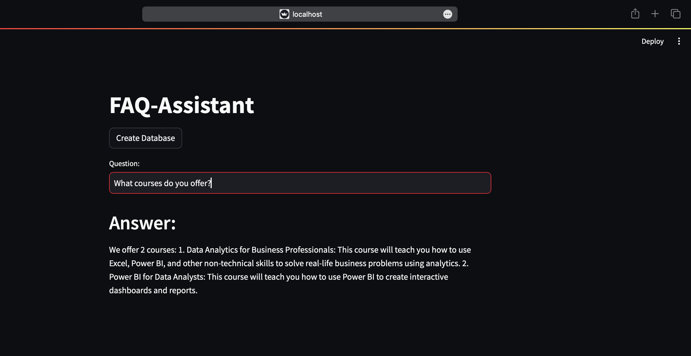

---
title: "FAQ Assistant"
excerpt: "Chatbot to answer previously answered queries for your company "
collection: portfolio
---

This is an end to end LLM project based on Google Gimini API, Langchain, HuggingFace. It is a  Q&A system which will provide a streamlit based user interface for people where they can ask questions and get answers(if their queries are already present in the database). 

## Project Highlights

- Use a real CSV file of FAQs that Codebasics company is using right now. 
- Their human staff will use this file to assist their course learners.
- We will build an LLM based question and answer system that can reduce the workload of their human staff.
- Students should be able to use this system to ask questions directly and get answers within seconds

## Tools Used
  - Langchain + Google Gimini API(free): LLM based Q&A
  - Streamlit: UI
  - Huggingface instructor embeddings: Text embeddings
  - FAISS: Vector databse
  - Streamlit (for user interface)

## GitHub Repository
[GitHub Repository](https://github.com/OmSDeshmukh/FAQ-Assistant)
