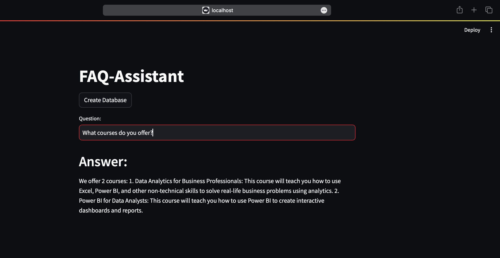

# NLDBQuery

NLDBQuery is a project that facilitates interaction with a database using plain English queries through Google's free Gemini Pro Large Language Model (LLM). It enhances model accuracy using Lang Chain and Hugging Face frameworks, along with few-shot learning techniques. Vector databases (ChromaDB) are also utilized to refine the results.

## Frameworks Used
- Lang Chain
- Hugging Face

## Acknowledgement
Special thanks to Codebasics for their valuable insights and guidance in creating this project.

## License
This project is licensed under the MIT License. See the LICENSE file for details.
